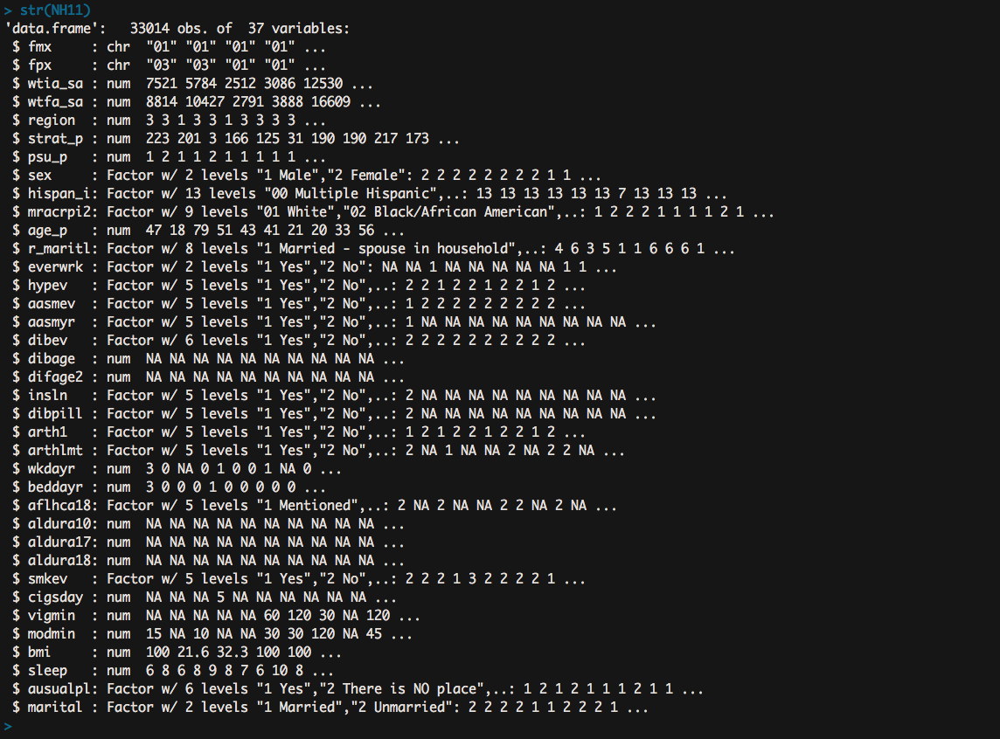

Logistic Regression - tutorial
------------------------------

_student work in R_ via the [Harvard Statistical Software Workshop](http://tutorials.iq.harvard.edu/R/Rstatistics/Rstatistics.html#orgheadline27). 

#### 'Regression with Binary Outcomes'

In R, `lm()` works wonderfully for continuous, dependent variables; but that is what it's limited to. `glm()` (generalized linear models) are able to fit models to categorical dependent variables.

``` r
NH11 <- readRDS("data/NatHealth2011.rds")
labs <- attributes(NH11)$labels
```

Using data from the National Health Institute Survey, we'll fit and analyze a model to estimates the probability of a person being diagnosed with hyptension based on their age, sex, hours of sleep, and body mass index.




```r
str(NH11$hypev)
levels(NH11$hypev)

#### Regression Model


``` r
hyp.out <- glm(hypev ~ age_p + sex + sleep + bmi,
			   data = NH11, family = "binomial")
```


#### Logistic Regression Coefficients

Taking a look at the coefficients, R is saying they all appear to be significant. But they are difficult to interpret unless you're used to thinking about values in terms of logarithms. A simple transform makes things easier to 'read.'

``` r
coef(summary(hyp.out))
```

		Coefficients:

					  Estimate Std. Error z value  Pr(>|z|)
		(Intercept) -4.2694660  0.0564947 -75.573  < 2e-16 ***
		age_p        0.0606993  0.0008227  73.779  < 2e-16 ***
		sex2 Female -0.1440251  0.0267977  -5.375 7.68e-08 ***
		sleep       -0.0070358  0.0016397  -4.291 1.78e-05 ***
		bmi          0.0185717  0.0009511  19.527  < 2e-16 ***		

		AIC: 34245

The reason the coefficients are a bit difficult to interpret is that `glm()` uses link functions - e.g., the `age_p` coefficient of 0.06 tells us that for every one unit increase in age, the *log odds* of hyptersion diagnosis goes up by 0.06...so why not transform this out of logs to get a better reading.

``` r
hyp.out.tab <- coef(summary(hyp.out))
hyp.out.tab[, "Estimate"] <- exp(coef(hyp.out))
hyp.out.tab
```

    				  Estimate   Std. Error    z value     Pr(>|z|)
    	(Intercept) 0.01398925 0.0564947294 -75.572820 0.000000e+00
    	age_p       1.06257935 0.0008227207  73.778743 0.000000e+00
    	sex2 Female 0.86586602 0.0267976605  -5.374540 7.677854e-08
    	sleep       0.99298892 0.0016397197  -4.290841 1.779981e-05
    	bmi         1.01874523 0.0009510828  19.526906 6.485172e-85


Now we have `age_p` with a more relatable estimate value of 1.06 - it could be said that with every year of age, the probability of a hypertension diagnosis goes up by a factor or 1. 

#### Generating Predicted Values 

After tranforming the *log odds* into *odds* by raising the natural log to the coefficient - we can now use the `predict()` function to make direct statements about the predictors in our model. An example question could be: 

_"How much more likely is a 63 year old female to have hypertension compared to a 33 year old female?"_

To answer, we'd create a dataset with predictors set at desired levels - which are: ages 33 and 63 (1st and 3rd quantiles of the `age_p` variable coincidentally), `sex` as female, and the mean values of `bmi` and `sleep` across the dataset.

``` r
predData <- with(NH11,
				 expand.grid(age_p = c(33, 63),
				 			 sex = "2 Female",
				 			 bmi = mean(bmi, na.rm = TRUE),
				 			 sleep = mean(sleep, na.rm = TRUE)))
```

	  age_p      sex      bmi   sleep
	1    33 2 Female 29.89565 7.86221
	2    63 2 Female 29.89565 7.86221

With this data, we'll bind our prediction directly to new frame for comparison and plotting.

``` r
cbind(predData, predict(hyp.out, type = "response",
						se.fit = TRUE, interval = "confidence",
						newdata = predData))
```

	    	age_p     	 sex      bmi   sleep       fit      se.fit
		1      33 	2 Female 29.89565 7.86221 0.1289227 0.002849622
		2      63 	2 Female 29.89565 7.86221 0.4776303 0.004816059

From the `fit` variable, we can see that a 33 year old female has a 13% probability of having been diagnosed with hypertension - while a 63 year old woman has a 48% probability of such. 

#### Zelig package - Computing and Graphing Predicted Values

``` r
library(effects)
plot(allEffects(hyp.out))
```

#### Questions

- Comparison to a baseline model - only necessary when making predictions from samples?

- 


