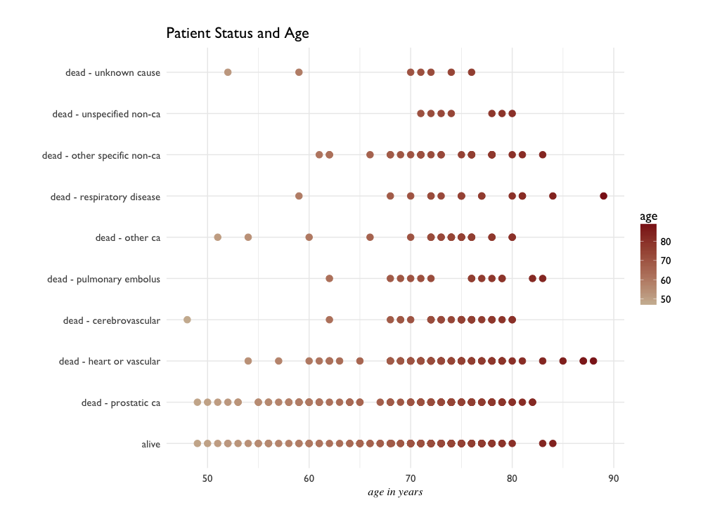
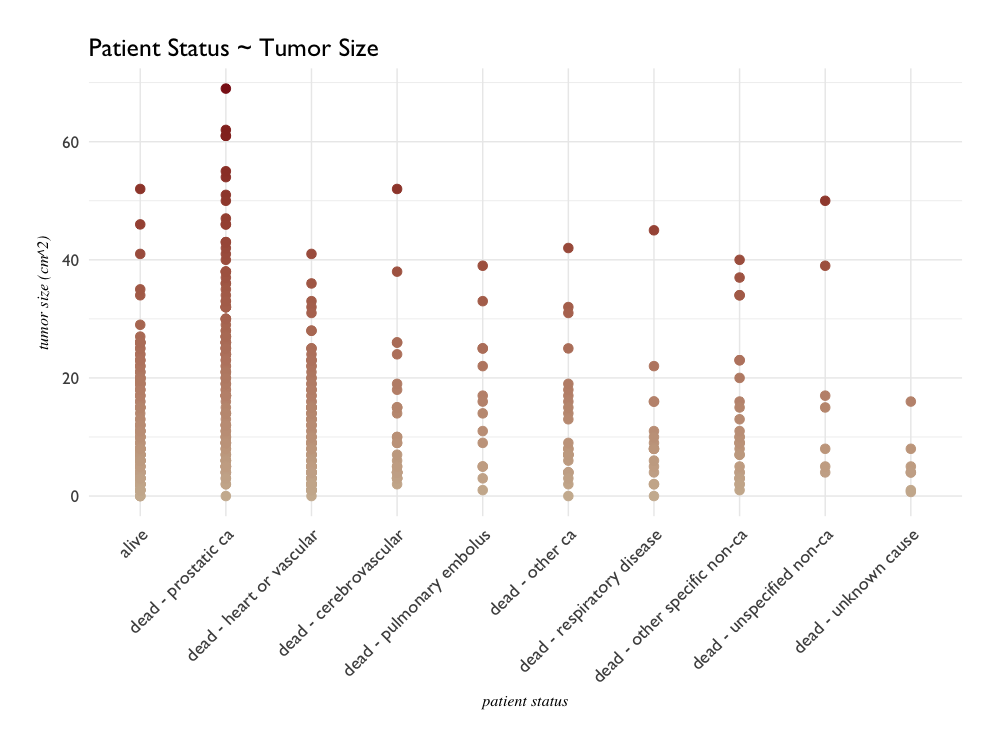
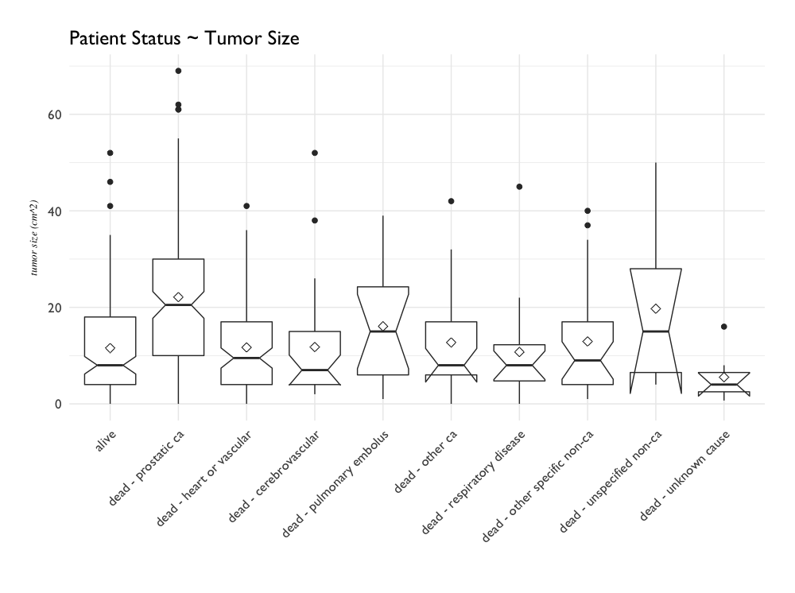
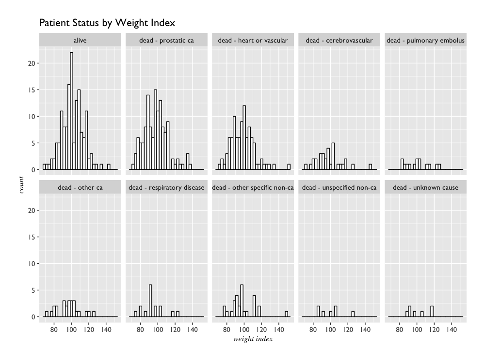
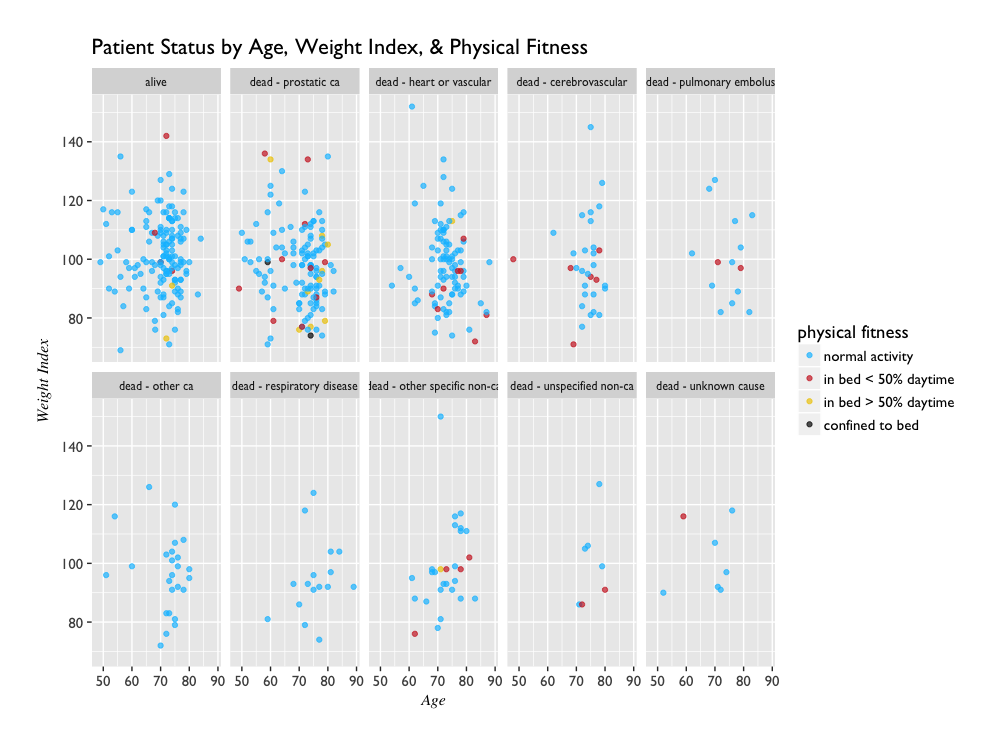
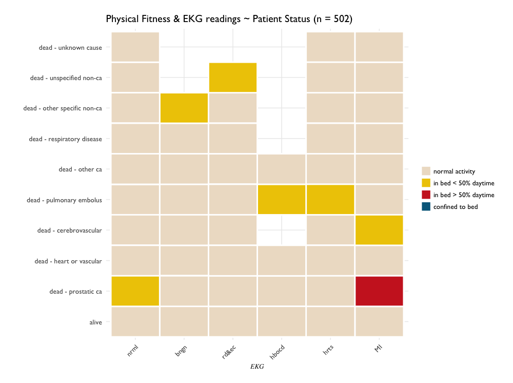
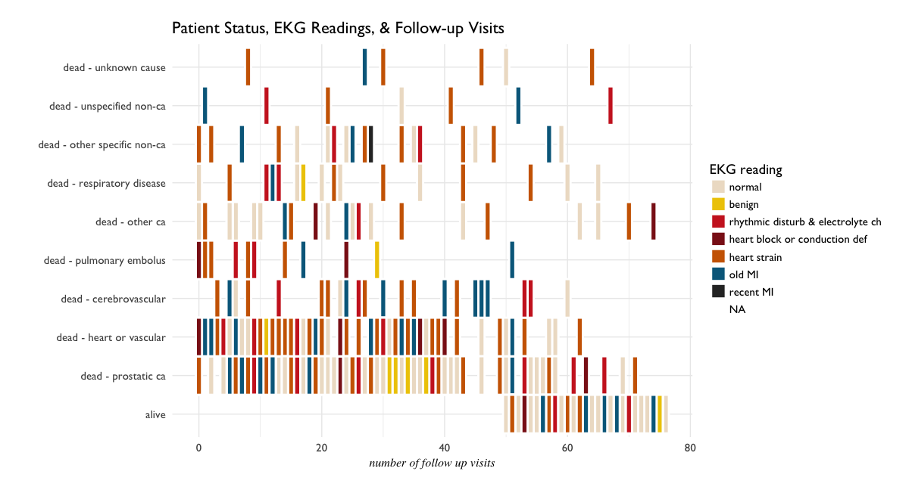

# notes on Binary Logistic Regression - RMS/Harrell

This is a workthrough of chapter 11 of the book [Regression Modeling Strategies](http://biostat.mc.vanderbilt.edu/wiki/Main/RmsShortAdd) by Frank E. Harrell. 

It's simply following the reading, taking notes, and running the code - with a few very slight additions of my own. These additions are generally to help me understand the dataset (i.e. exploratory plots). 

The goal of the case study is to fit a binary logistic regression model that predicts cardio- and cerebro-vascular death among prostate cancer patients, using a dataset containing variables on patient baselines (weight, age, blood pressure), treatments, and time of death. 

Data originally was collected from a randomized trial of estrogen treatment of prostate cancer. In a previous case study it was shown that the estrogen treatment reduced the effect of prostate cancer at the expense of increased risk for cardiovascular death. 


```{r}
library(rms)
getHdata(prostate)
```

## Simple Questions and Exploratory Plots

```{r, message=FALSE}
library(rms)
getHdata(prostate)

summary(prostate)
#     patno           stage                     rx          dtime      
# Min.   :  1.0   Min.   :3.000   placebo        :127   Min.   : 0.00  
# 1st Qu.:126.2   1st Qu.:3.000   0.2 mg estrogen:124   1st Qu.:14.25  
# Median :251.5   Median :3.000   1.0 mg estrogen:126   Median :34.00  
# Mean   :251.7   Mean   :3.424   5.0 mg estrogen:125   Mean   :36.13  
# 3rd Qu.:376.8   3rd Qu.:4.000                         3rd Qu.:57.75  
# Max.   :506.0   Max.   :4.000                         Max.   :76.00  
                                                                      
#                          status         age              wt                            pf     
# alive                       :148   Min.   :48.00   Min.   : 69.00   normal activity     :450  
# dead - prostatic ca         :130   1st Qu.:70.00   1st Qu.: 90.00   in bed < 50% daytime: 37  
# dead - heart or vascular    : 96   Median :73.00   Median : 98.00   in bed > 50% daytime: 13  
# dead - cerebrovascular      : 31   Mean   :71.46   Mean   : 99.03   confined to bed     :  2  
# dead - other specific non-ca: 28   3rd Qu.:76.00   3rd Qu.:107.00                             
# dead - other ca             : 25   Max.   :89.00   Max.   :152.00                             
# (Other)                     : 44   NA's   :1       NA's   :2                                  
#       hx              sbp             dbp                                        ekg     
# Min.   :0.0000   Min.   : 8.00   Min.   : 4.000   normal                           :168  
# 1st Qu.:0.0000   1st Qu.:13.00   1st Qu.: 7.000   heart strain                     :150  
# Median :0.0000   Median :14.00   Median : 8.000   old MI                           : 75  
# Mean   :0.4243   Mean   :14.35   Mean   : 8.149   rhythmic disturb & electrolyte ch: 51  
# 3rd Qu.:1.0000   3rd Qu.:16.00   3rd Qu.: 9.000   heart block or conduction def    : 26  
# Max.   :1.0000   Max.   :30.00   Max.   :18.000   (Other)                          : 24  
#                                                   NA's                             :  8  
#       hg               sz              sg              ap                bm             sdate     
# Min.   : 5.899   Min.   : 0.00   Min.   : 5.00   Min.   :  0.100   Min.   :0.0000   Min.   :2652  
# 1st Qu.:12.299   1st Qu.: 5.00   1st Qu.: 9.00   1st Qu.:  0.500   1st Qu.:0.0000   1st Qu.:2860  
# Median :13.699   Median :11.00   Median :10.00   Median :  0.700   Median :0.0000   Median :3021  
# Mean   :13.446   Mean   :14.63   Mean   :10.31   Mean   : 12.176   Mean   :0.1633   Mean   :3039  
# 3rd Qu.:14.699   3rd Qu.:21.00   3rd Qu.:11.00   3rd Qu.:  2.975   3rd Qu.:0.0000   3rd Qu.:3204  
# Max.   :21.199   Max.   :69.00   Max.   :15.00   Max.   :999.875   Max.   :1.0000   Max.   :3465  
#                  NA's   :5       NA's   :11                                                

```
Overall, there are 502 observations of 18 variables - quantitative, categorical, and even one that might be considered ordinal. Quite a bit to take in. 

Just to get a sense of things visually beyond the summary, I'm going to do a couple of quick plots before going through the textbook code. 

In addition to exploring relationships between variables, will also be exploring a few different plot types to see what how different variables communicate.

First a look at `age` and patient `status`, then maybe looks at how other patient baseline variables relate to patient `status`. Will there be any trends in patient age amongst the different status categories? 

Broadly speaking, it appears death from heart or vascular disease seems to strike a wide range of ages. 

Cerebrovascular deaths are concentrated largely in patients between ages 70-80.

```{r}
# plot age and patient status
ggplot(prostate, aes(age, status, color = age)) + 
  geom_point(size = 3, shape = 19) +
  scale_color_gradient(low = "bisque3", high = "firebrick4") +
  theme_minimal(base_size = 14, base_family = "GillSans") +
  theme(plot.margin = unit(c(1, 1, 1, 1), "cm"),
        axis.title.x = element_text(family = "Times", 
                                    face = "italic",
                                    size = 12)) +
  labs(title = "Patient Status and Age", 
       x = "age in years", y = "")
```



Tumor size, and relationship to patient status: could this give clues to which deaths could be attributed to cancer, and which could be attributed to the potential adverse effects of the estrogen treatment? 

```{r}
# tumor size and relation to status
ggplot(prostate, aes(status, sz, color = sz)) +
  geom_point(size = 3, shape = 19) +
  scale_color_gradient(low = "bisque3", high = "firebrick4") +
  theme_minimal(base_size = 16, base_family = "GillSans") +
  theme(plot.margin = unit(c(1, 1, 1, 1), "cm"),
        axis.text.x = element_text(angle = 45, size = 14,
                                    hjust = 1, vjust = 1),
        axis.title.x = element_text(size = 12, family = "Times", face = "italic"),
        axis.title.y = element_text(size = 12, family = "Times", face = "italic")) +
  labs(title = "Patient Status ~ Tumor Size", 
       y = "tumor size (cm^2)", x = "patient status", color = "") +
  guides(color = F)
```



- Most of the obseravations on tumor size fall into the category death from prostatic cancer category. 
- Tumors larger than a certain size (approx 52 cm^2) are solely responsible for prostatic cancer death.
- a boxplot _might_ be better suited for making observations in this case:

```{r}
# patient status and tumor size: boxplot
ggplot(prostate, aes(status, sz)) +
  geom_boxplot(notch = T, outlier.size = 2, outlier.shape = 19) +
  stat_summary(fun.y = "mean", geom = "point", shape = 23, size = 3, fill = "white") +
  theme_minimal(base_size = 16, base_family = "GillSans") +
  theme(plot.margin = unit(c(1, 1, 1, 1), "cm"),
        axis.text.x = element_text(angle = 45, hjust = 1, vjust = 1),
        axis.title.y = element_text(family = "Times",
                                    face = "italic",
                                    size = 10)) +
  labs(title = "Patient Status ~ Tumor Size", 
       y = "tumor size (cm^2)", x = "")

```



- the mean values for tumor size appear to show less variance across the status categories.
- while the highest mean is associated with prostatic cancer death, the next highest is associated with unspecified non-cancer deaths.
- range of tumor sizes is widest in prostatic cancer deaths.

Maybe it would be better to look at more general patient variables. How does patient weight play a role in the observations? The `wt` variable refers to weight index, which is computed from a patient's weight(kg) - height(cm) + 200. 

Weight Index across Patient Status categories:
```{r}
ggplot(prostate, aes(wt)) + 
  geom_histogram(fill = "white", color = "black") +
  facet_wrap(~ status, nrow = 2) +
  theme_gray(base_size = 14, base_family = "GillSans") +
  theme(plot.margin = unit(c(1, 1, 1, 1), "cm"),
        axis.title.x = element_text(size = 12, face = "italic", family = "Times"),
        axis.title.y = element_text(size = 12, face = "italic", family = "Times")) + 
  labs(title = "Patient Status by Weight Index",
       x = "weight index", y = "count")

```



Age and Weight across the Patient Status categories:

```{r}
ggplot(prostate, aes(age, wt)) +
  geom_point(aes(color = pf), data = prostate, size = 1.5, alpha = 0.68) +
  facet_wrap( ~ status, ncol = 5) +
  scale_color_manual(values = c("deepskyblue1",
                                "firebrick3",
                                "gold2",
                                "black")) +
  theme_gray(base_size = 14, base_family = "GillSans") +
  theme(plot.margin = unit(c(1, 1, 1, 1), "cm"),
        axis.title.x = element_text(size = 12, face = "italic", family = "Times"),
        axis.title.y = element_text(size = 12, face = "italic", family = "Times"),
        strip.text = element_text(size = 9)) + 
  labs(title = "Patient Status by Age, Weight Index, & Physical Fitness",
       x = "Age", y = "Weight Index", color = "physical fitness")
  
```  



There are categorical variables that might be of interest `ekg`, `pf`, `status` - how do they interact?
Do physical fitness and ekg readings have any relationship in terms of patient status? 

Physical fitness might not be the most telling variable; the majority of the observations point to normal health. Only a relatively small handful spend less than half their day in bed _(37/502)_, and even less spend more than that _(13/502)_. Only 2 patients are completed confined to bed; graphically, these patients aren't reflected in this categorical heatmap. 

```{r}
ggplot(prostate, aes(ekg, status, fill = pf)) +
  geom_tile(color = "white", size = 1) +
  scale_fill_manual(values = c("antiquewhite2",
                               "gold2",
                               "firebrick3",
                               "deepskyblue4")) +
  theme_minimal(base_size = 12.75, base_family = "GillSans") +
  theme(plot.margin = unit(c(0.75, 0.75, 0.75, 0.75), "cm"),
        axis.text.x = element_text(angle = 45, hjust = 1, vjust = 1),
        axis.title.x = element_text(family = "Times", face = "italic", size = 10),
        axis.title.y = element_text(family = "Times", face = "italic", size = 10)) +
  labs(title = "Physical Fitness & EKG readings ~ Patient Status (n = 502)", y = "",
       x = "EKG", fill = "") 

```



Nonetheless, EKG readings will come up later in the data transformations; how does this categorical interact with patient status and number of follow-up visits?

```{r}
ggplot(prostate, aes(dtime, status, fill = ekg)) +
  geom_tile(color = "white", size = 1) +
  scale_fill_manual(values = c("antiquewhite2", 
                               "gold2", 
                               "firebrick3",
                               "firebrick4", 
                               "darkorange3", 
                               "deepskyblue4",
                               "gray18")) +
  theme_minimal(base_size = 14, base_family = "GillSans") +
  theme(plot.margin = unit(c(0.75, 0.75, 0.75, 0.75), "cm"),
        axis.title.x = element_text(family = "Times", 
                                    face = "italic",
                                    size = 12)) +
  labs(title = "Patient Status, EKG Readings, & Follow-up Visits", y = "",
       x = "number of follow up visits", fill = "EKG reading") 

```



loose observations:

- Only one recent myocardial infarction shows up, while a handful of old ones do. 
- An older MI appears across all patient status categories.
- Heart strain and heart block are two EKG results that had zero follow-up visits. It's tempting to infer a correlation between the EKG result and cause of death, but there's a question of time elapsed between the EKG visit and death. Additionally, the other two cases with no follow up visit returned 'normal' EKG results. 

## Data Transformations and Single Imputation

The first chunk of code here conbines infrequent categories, specificially the old and recent MI observations from the EKG variable. As noticed just above, there is only one instance of a recent MI. 

```{r}
# Data transformation and Single Imputation -----------------------------------
# combine infrequent category with the next category
# dichotomize `ekg` for use in ordinary principal components
prostate <- within(prostate, {
  
  # combine infrequent categories
  levels(ekg)[levels(ekg) %in%
                c("old MI", "recent MI")] <- "MI"
  
  # dichotomize `ekg` values
  # '1' for 'normal' and 'benign' values of ekg
  # '0' for others ()
  ekg.norm <- 1 * (ekg %in% c("normal", "benign"))
  levels(ekg) <- abbreviate(levels(ekg))
  
  pfn <- as.numeric(pf)
  levels(pf) <- levels(pf[c(1, 2, 3, 3)])
  
  cvd <- status %in% c("dead - heart or vascular",
                       "dead - cerebrovascular")

})
```

Look into: `transcan` and `impute` functions in `rms` library.

A breakdown of each method in the following two code chunks:

- compute pre-tranformations on all variables (using `transcan`)
- single imputation on pre-transformations

- `transcan` (from the documentation): 'automatically transforms continuous and categorical variables to have maximum correlation with the best linear combination of other variables'. This is something that sounds good to me, but will need to look into how the 'automatic transformation' takes place. _r-squared_ values are returned, and in this case they tend to suggest weak postitive correlations. 

the highest _r-squared_ values returned from the pre-transformation:
- `ap` - patient treatment:  Serum Prostatic Acid Phosphotase
- `sg` - patient observation: index of cancer Stage + cardiovascular History
- `sbp`- patient observation: systolic blood pressure


```{R}
# Use `transcan` to compute optimal pre-transformations
ptrans <- transcan(~ sz + sg + ap + sbp + dbp + age + wt + hg + ekg +
                     pf + bm + hx + dtime + rx, 
                   imputed = T, transformed = T, data = prostate, pl = F, pr = T)

# Use `transcan` single imputations
imp <- impute(ptrans, data = prostate, list.out = T)
```

From here, the data can be reduced to outcomes of interest. This subset is applied to reduce both the set of transformed and raw variables.

```{r}
NAvars <- all.vars(~ sz + age + wt + ekg)
for(x in NAvars) 
  prostate [[x]] <- imp[[x]]

# subset outcomes of interest
subset <- prostate$status %in% c("dead - heart or vascular", 
                                 "dead - cerebrovascular",
                                 "dead - prostatic ca")

# tranformed data reduced to outcomes of interest
trans <- ptrans$transformed[subset, ]

# raw data reducted to outcomes of interest
psub <- prostate[subset, ]
```


## Regression on Ordinal Variables, Principal Components, and Pretransformations

#### Principal Components Computation

- compute the first 8 Principal Components on the raw variables (`psub`)
- compute the first 8 Principal Components on the transformed variables (`trans`). 
- define a function `ipc` that accepts arguments for variables, data, and k; and uses these to compute k number of Principal Components (`princomp`)
- note that the logistic regression model (`lrm` call) on the transformed used the raw variables as data source, but transformed Principal Components as dependent variable.

- _is there an `rxn` variable or is that a typo?_


```{r}
# function to compute the first k principal components
ipc <- function(x, k = 1, ...)
  princomp(as.numeric(x), ..., cor = TRUE)$scores[,1:k]

# compute the first 8 PCs on raw variables 
# then on transformed variables

# Principal Components on raw variables
pc8 <- ipc(~ sz + sg + log(ap) + sbp + dbp + age + 
             wt + hg + ekg.norm + pfn + bm + hx + rx + dtime,
           data = psub, k = 8)

f8 <- lrm(cvd ~ pc8, data = psub)

# Principal Components on cooked variables
pc8t <- ipc(trans, k = 8)
f8t <- lrm(cvd ~ pc8t, data = psub)
```
  
There's an issue above the data classes. This will be returned to.

#### Binary Logistic Regression Models

on:
- original variables
- expanded continuous variables (using splines)
- an individual transformed variable

Taken with the PCA from the previous chunk, there will be 5 methods total for fitting a binary logistic regression model executed here. After examining and comparing the fits on raw and transformed variables, we can describe and then validate the models. 

TODO: look into variable classes and Harrell functions.

```{r}
# Fit binary logistic regression model on original variables
f <- lrm(cvd ~ sz + sg + log(ap) + sbp + dbp + age + wt +
           hg + ekg.norm + pfn + bm + hx + rx + dtime,
           data = psub)

# Expand continuous variables using splines
```